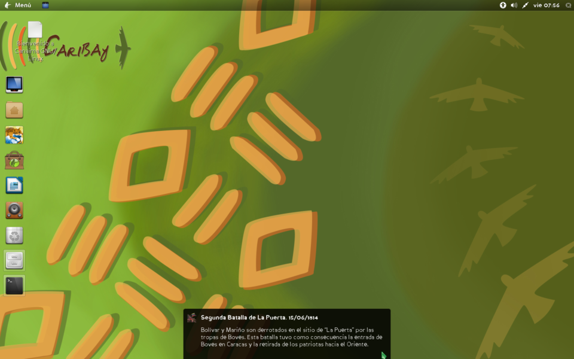
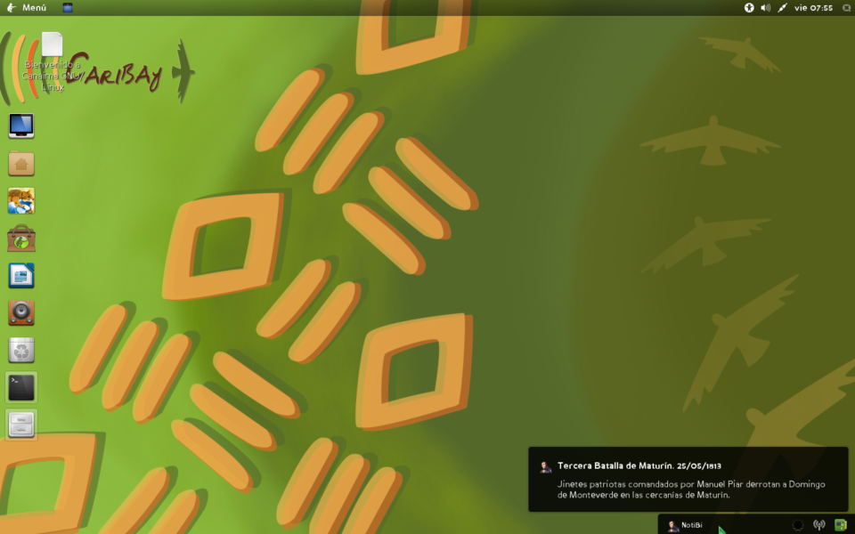
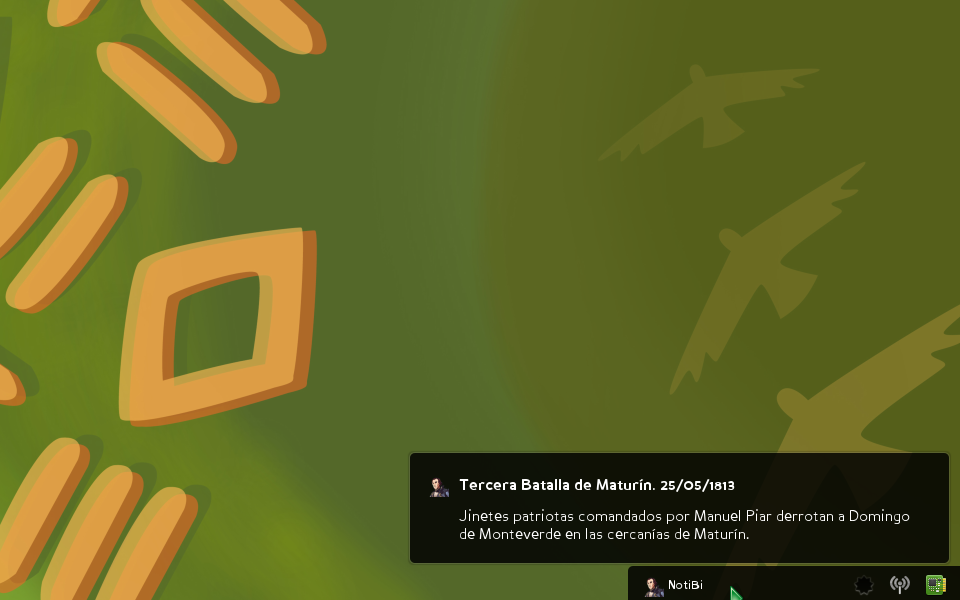

NotiBi
======
Sistema de Notificaciones Bicentenarias.

----

Sinopsis
--------

Sistema de notificaciones con mensajes alusivos a la campaña bicentenaria de Venezuela. Realizado para la Fundación Centro Nacional de Desarrollo e Investigaciones en Tecnologías Libres.
  
NotiBi es un sistema que despliega en pantalla mensajes con contenidos que relatan de forma resumida acontecimientos sucedidos durante la gesta independentista de Venezuela. 
  
NotiBi está hecho en python y despliega los mensajes a través del sistema de notificaciones de `gnome (>= 3.x)`. 

Requisitos
----------

NotiBi requiere los siguientes paquetes:

 * `python >= 2.6`
 * `python-notify >= 0.1.1`

Uso
---

    notibi [-t segundos] [-m /ruta/archivo.csv] [-g /ruta/directorio_iconos]

    opciones:
      --version      muestra el número de versión del programa
      -h, --help     muestra este mensaje de ayuda
      -t segundos    establece el tiempo en segundos entre cada notificación
      -m archivo     establece la ubicación y nombre del archivo de mensajes formato csv
      -g directorio  establece la ubicación y nombre de la carpeta de iconos

Compatibilidad
--------------
Probado en distribuciones con entorno Gnome 3
 * Debian Wheezy
 * Caribay 4.0 
 * Canaima 4.x
 * Ubuntu 14.04*

*Nota: Ubuntu 14.04 despliega los mensajes, pero como el entorno no cuenta con área de notificación, los mensajes no se almacenan en ésta como en otras distribuciones que usan Gnome 3.

Capturas
--------

 

 

 

Información
-----------

**Proyecto bicentenario**: http://bicentenario.cenditel.gob.ve 
**Repositorio**: http://github.com/davidhdz/notibi

